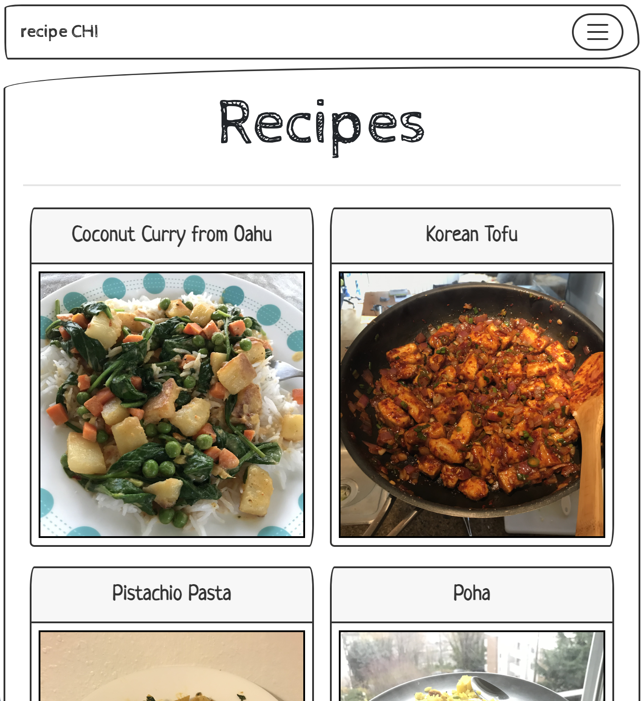
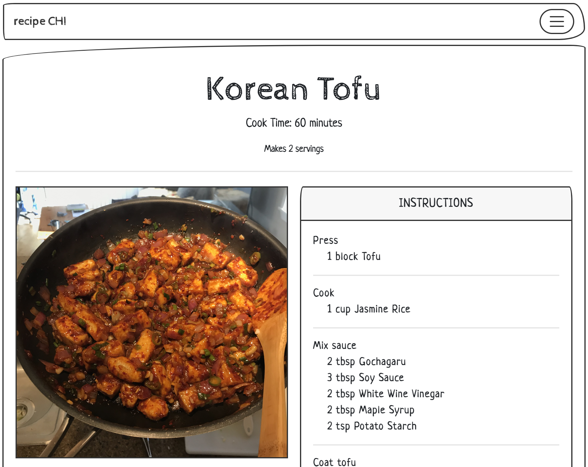
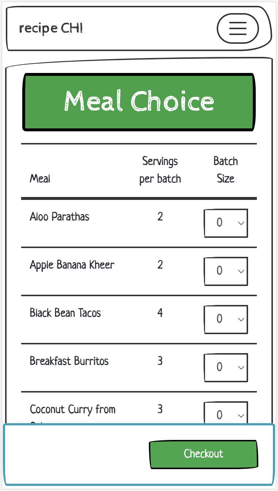
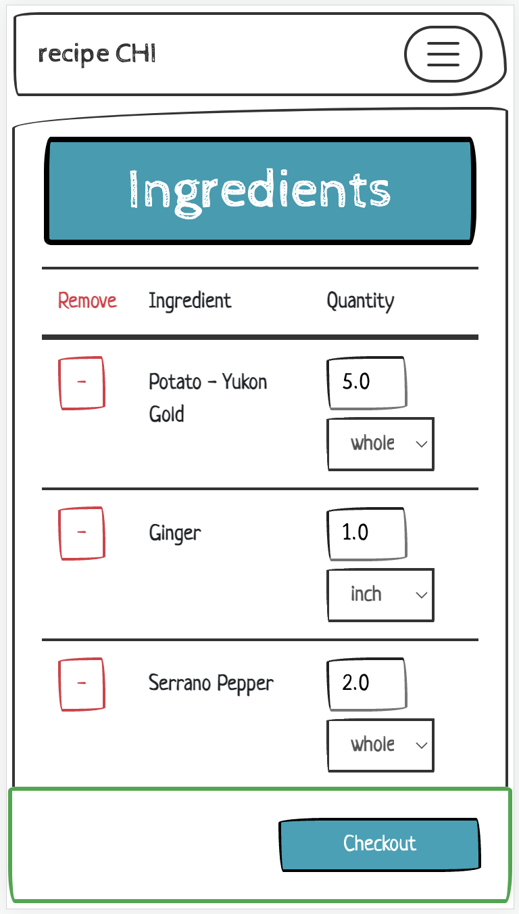
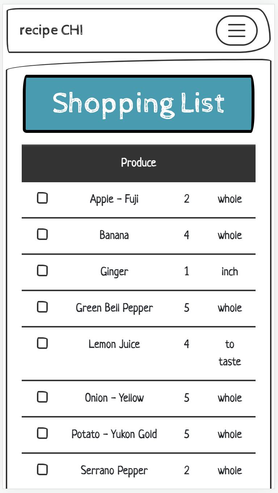

# Recipe Chi

RecipeChi is a web application built with Python/Django that contains two complimentary features:

1. A recipe blog that formats recipes in a way that's easy to read when cooking.
2. A grocery planner. You pick the meals that you're planning on making and Recipe Chi will create a grocery list to let you know what you need to pickup at the supermarket.

## Recipes

Recipes list page:

Recipe detail page:

## Grocery Planner

Step 1: Choose Recipes

Step 2: Edit the ingredients that you need

Step 3: A grocery list you can you when you're at the store

